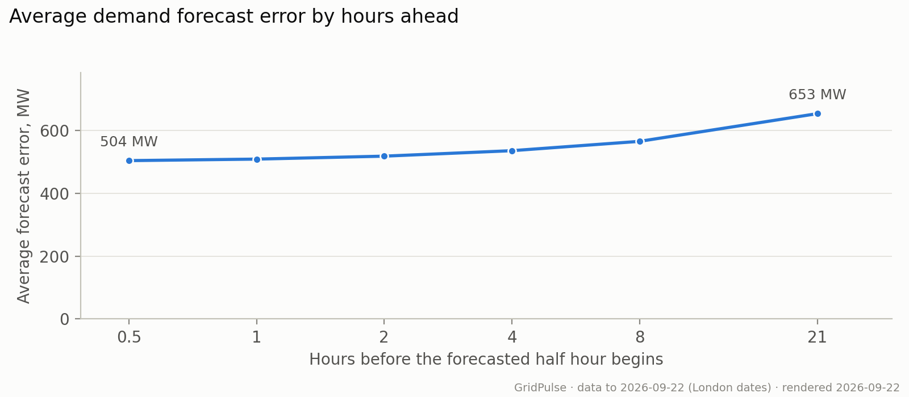
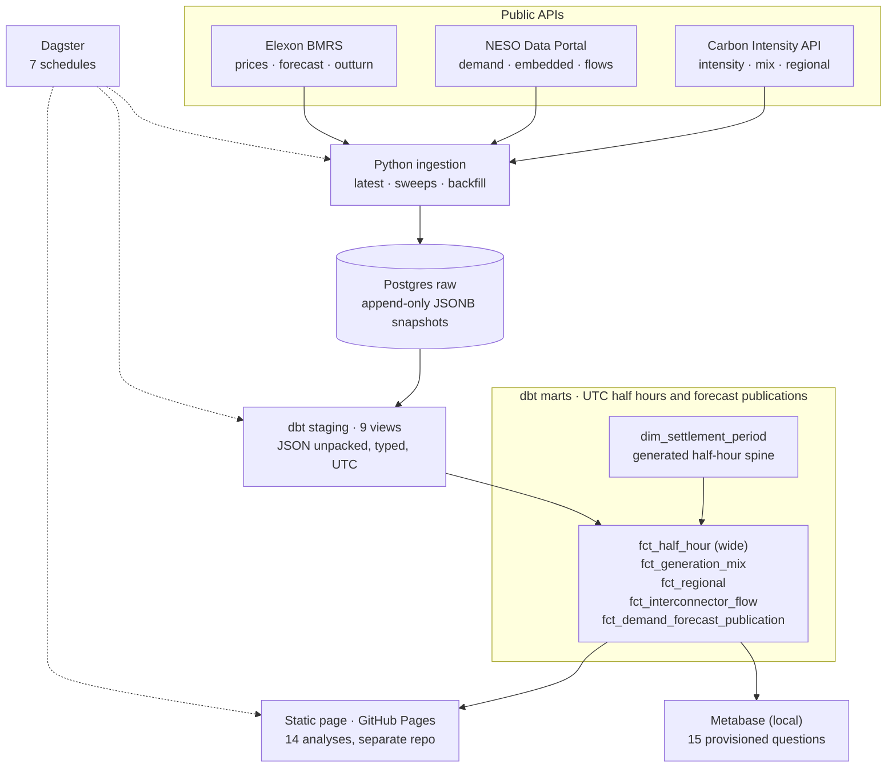

# GridPulse

**Electricity data analytics for Great Britain: carbon intensity, wholesale prices and demand forecast accuracy, backed by a reproducible Python, SQL and dbt pipeline.**

**[View the live dashboard →](https://thrkld.github.io/gridpulse-dashboard/)**
Explore 14 analyses with plain-language explanations, dated findings, expandable
methods and data tables. No installation required. The dashboard is a published
snapshot; check its update and coverage dates when interpreting the results.

[](https://github.com/thrkld/gridpulse/actions/workflows/ci.yml)
[](pyproject.toml)
[](dbt/models)
[](LICENSE)

## Findings · 22 September 2026

**[Read the 14-chart analysis](docs/findings.md)** — figures, explanations and
limitations are available here without installing anything.

- **Daily timing:** average carbon intensity was lowest at **13:00
  (108 gCO₂/kWh)**; the lowest average APX wholesale price occurred at **03:30
  (£67.98/MWh)**. Their average minima differ; this does not establish daily
  coincidence. [See the chart](docs/findings.md#daily-pattern).
- **Forecast accuracy:** average demand forecast error was **504 MW at 30 minutes** versus
  **653 MW at 21 hours**, scored on the same **35,466 half hours**. Forecasts made closer to the predicted half hour were more accurate on this matched sample.
  [See the chart](docs/findings.md#demand-accuracy).
- **Negative prices:** **1,322 of 47,734 priced half hours (2.8%)** had a negative
  APX wholesale price since 2024. Missing prices are excluded; the current month
  is partial. [See the chart](docs/findings.md#negative-price-frequency).

These findings are a dated snapshot, not live readings. The full report also
groups the analysis into daily patterns, electricity supply and trade, prices,
forecast accuracy and data quality. It includes country imports and exports,
imbalance versus wholesale prices, price conditions and coverage checks.
Metabase offers the same measures for further exploration.

[](docs/findings.md#demand-accuracy)

## Analytical approach

- Compare carbon and prices on matched half hours, and forecasts made different numbers of hours ahead on the
  same target periods.
- Keep missing values distinct from zero and define the denominator for every
  rate or ratio.
- Preserve forecast publications for historical accuracy evaluation, and
  distinguish estimates, forecasts and observed values.
- Audit source revisions and coverage before interpreting changes. See the
  [data audit](docs/dashboard_data_audit.md) for evidence and limitations.

## Architecture



The **raw** layer preserves append-only API snapshots in PostgreSQL JSONB.
**Staging** views unpack and type the data and normalise settlement times to UTC.
The six **marts** include a generated settlement-period spine and facts for joined
half-hour observations, generation mix, regions, interconnectors and forecasts.
Observation facts resolve source revisions at their own grain; the forecast fact
retains each publication for a target half hour so comparisons of forecasts made different numbers of hours ahead remain
possible. [Design decisions](docs/decisions.md) explain the trade-offs.

Matplotlib and Metabase share the analytical SQL in `scripts/metabase/`.
The static report is readable without JavaScript; its optional freshness warning
checks the build age and newest source ingestion. It does not establish freshness
for every individual source. Metabase provides local exploration through
repository-managed questions.

## Operations

Python ingestion and dbt transformations run on an Azure VM with Azure Database
for PostgreSQL. Dagster coordinates ingestion, revision sweeps and model builds.
The dashboard is published on [GitHub Pages](https://thrkld.github.io/gridpulse-dashboard/),
with a six-hourly publishing schedule implemented in Dagster. See
[deployment and schedules](docs/operations.md).

## Dealing with different 'clocks'

Carbon Intensity and Elexon both publish UTC instants, but NESO publishes a *local* settlement date together with a period number. That means a NESO day has 46 periods when the clocks go forward in spring and 50 when they go back in autumn. Normalising everything to UTC on the way in is what stops those two conventions from colliding.

## Data sources

| Source | Data | Initial load | Ongoing | Revision sweep |
|---|---|---|---|---|
| [Carbon Intensity API](https://carbonintensity.org.uk/) | gCO₂/kWh, generation mix, national + regional | backfill from 2024-01-01 via date-range endpoints, fetched in ~14-day chunks (regional is 7 days) | every 30 min | daily, trailing 48 h. Actuals land within hours and are stable after a day; regional is forecast-only, so no sweep |
| [NESO Data Portal](https://www.neso.energy/data-portal) | national demand, embedded generation, interconnector flows | one call per year against the historic demand resources, from 2024-01-01 | 2x daily full snapshot | built in: the live feed is a rolling window, so every fetch re-captures the full revision period |
| [Elexon BMRS](https://bmrs.elexon.co.uk/) | imbalance prices, market index, demand forecast and outturn | backfill from 2024-01-01: one call per settlement date for imbalance and one per day of publications for the forecast | every 30 min | daily trailing 7 days (interim settlement run) and weekly trailing 35 days (initial settlement run); later reconciliation runs are out of scope by design |

Revision sweeps append new snapshots; observation models select the latest
version while the demand-forecast model retains publication history.

## Running it

Requires Docker and Python 3.12+.

```bash
git clone https://github.com/thrkld/gridpulse && cd gridpulse

# database
cp .env.example .env # local password, plus PG* settings if using a hosted database
docker compose up -d
docker exec -i gridpulse-postgres-1 psql -U gridpulse -d gridpulse < sql/raw_tables.sql

# ingestion
pip install -r requirements.txt -e .
python -m gridpulse.ingest.run_carbon_intensity
python -m gridpulse.ingest.run_neso
python -m gridpulse.ingest.run_elexon

# historical load, run once per database
python scripts/backfill.py

# orchestration (schedules ingestion, dbt and publishing per the table above)
dagster dev -f src/gridpulse/orchestration/definitions.py -p 3001

# transformations
pip install -r requirements-dbt.txt
cd dbt && dbt deps && dbt build
```

dbt reads `dbt/profiles.yml`, which is committed and takes its connection details from the environment, so the same file serves a laptop, the local Docker database and the deployed container. It has a `dev` output pointing at localhost and a `prod` output for the hosted database.

dbt does not read `.env` itself, so export it first when building against the cloud:

```bash
set -a && . .env && set +a
cd dbt && DBT_TARGET=prod dbt build
```

Once the marts exist, `python -m gridpulse.charts site --out build/site` writes the dashboard page and its PNGs locally, without publishing anything. Publishing additionally needs `DASHBOARD_REPO` and a fine-grained `DASHBOARD_TOKEN` holding contents write on the dashboard repository alone. Metabase setup is in [docs/metabase.md](docs/metabase.md).

## Testing

**pytest** covers the settlement-period conversion including the days the clocks change, the backfill chunking and the date ranges it produces, the sweep windows, how failed requests are retried, and how the database connection is resolved from the environment. Dashboard tests cover update/recovery behaviour, scope protection and chart definitions. PostgreSQL fixtures check missing-value denominators, matched samples, forecast timings, flow aggregation, carbon/price alignment and publication windows.

**dbt** defines 203 tests across staging and marts. Those check the grain of each model is unique, that null constraints have a severity matching how load-bearing the column is, that values fall in accepted ranges, and that no model has silently lost periods, because a table with holes in it passes every test that only examines rows which exist. The NDF publication-window test warns after a two-UTC-day grace period; it can flag source delays as well as ingestion gaps and needs investigation, not automatic zero-filling.

**CI** runs pytest and ruff, both format and lint, on every push and pull request, and builds every dbt model against an empty Postgres.

```
make check # See 'Makefile' for specific format of tests
cd dbt && dbt build
```

The SQL fixture tests and the Metabase end-to-end test need external services and are described in [docs/metabase.md](docs/metabase.md#integration-tests).

## Documentation

| Document | What is in it |
|---|---|
| [decisions.md](docs/decisions.md) | Every design decision, what was rejected in its place, and its current status |
| [incidents.md](docs/incidents.md) | Operational history since the first unattended run, and what changed after each one |
| [probe_findings.md](docs/probe_findings.md) | What each source actually publishes, its latency, and its permanent gaps |
| [dashboard_data_audit.md](docs/dashboard_data_audit.md) | Audit of the figures behind every dashboard question |
| [metabase.md](docs/metabase.md) | Provisioning the local Metabase dashboard, and the integration tests |
| [operations.md](docs/operations.md) | Deployment and schedule details |

## Remaining work

- Provision and visually verify the main Metabase instance.
- Validate response shapes during ingestion and add seeded dbt fixtures in CI.
- Explore a demand/price forecasting consumer.

## Attribution & licences

- **Elexon**: contains BMRS data © Elexon Limited copyright and database right 2026, licensed under the [BMRS data licence](https://www.elexon.co.uk/bsc/data/balancing-mechanism-reporting-agent/copyright-licence-bmrs-data/).
- **Carbon Intensity API**: data provided by the National Energy System Operator via the [Carbon Intensity API](https://carbonintensity.org.uk/), licensed under [CC BY 4.0](https://creativecommons.org/licenses/by/4.0/).
- **NESO**: supported by National Energy SO Open Data, under the [NESO Open Licence](https://www.neso.energy/data-portal/neso-open-licence).

Those licences apply to the ingested data. The code in this repository is licensed under the [MIT License](LICENSE).
