# Electricity analysis — 22 September 2026

Fourteen analyses of Great Britain's electricity, grouped by topic. This saved report uses the database extract completed on 22 September 2026 at 20:44 UTC. Each chart states its window; current-month results are partial. The report does not refresh automatically.

## Explore the analysis

**Daily patterns:** [Average Carbon Intensity and Wholesale Price by Half Hour](#daily-pattern) · [Overlap of Cheap and Low-Carbon Periods](#daily-minima)

**Electricity supply and trade:** [Midday National Demand and Embedded Solar](#midday-solar) · [Net Imports Relative to National Demand](#net-imports) · [Electricity Imports and Exports by Country](#country-flows) · [Forecast Carbon Intensity and Mix by Nation](#nations)

**Prices and grid conditions:** [Negative Wholesale Price Frequency](#negative-price-frequency) · [Grid Conditions During Negative Prices](#negative-conditions) · [Imbalance and Wholesale Price Gap](#imbalance-spread) · [Imbalance Prices by Grid Conditions](#imbalance-conditions)

**Forecast accuracy:** [Average Demand Forecast Error by Hours Ahead](#demand-accuracy) · [Carbon Forecast Error by Month](#carbon-accuracy)

**Data quality:** [Monthly Data Coverage](#coverage) · [Demand Forecast Publication Coverage](#publication-coverage)

## Daily patterns

### Average Carbon Intensity and Wholesale Price by Half Hour

**What this graph shows:** Two daily profiles show how average carbon intensity and wholesale electricity prices vary by time of day in Great Britain. The blue line shows carbon intensity; the orange line shows price.

**Findings (as of 22 September 2026):** Across the half-hourly averages, carbon intensity is lowest at 13:00 (108 gCO₂/kWh), while the APX wholesale price is lowest at 03:30 (£67.98/MWh). These are historical averages, not a prediction for any individual day.

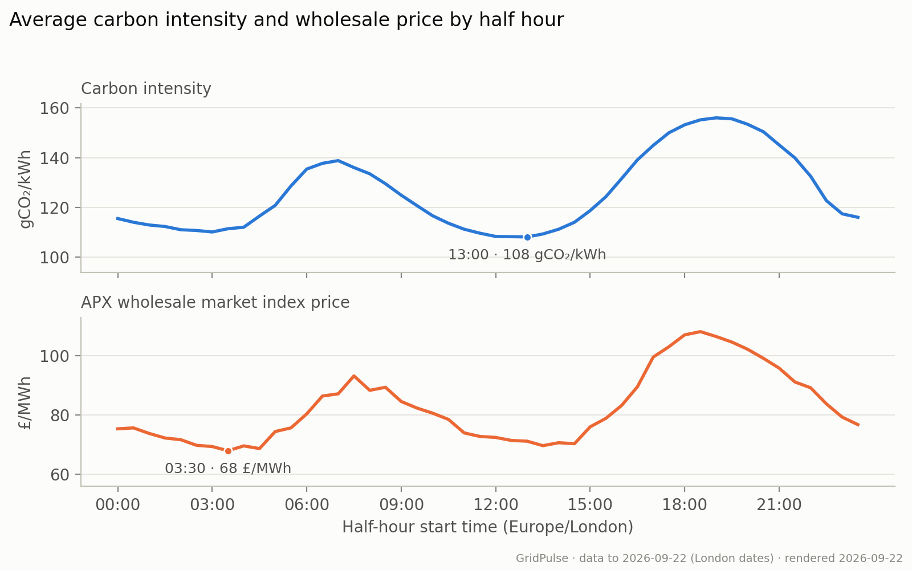

**Limitations:** Averages combine seasons and years and do not measure daily coincidence of the cheapest and lowest-carbon periods. APX is a wholesale index, not a household tariff.

How to read this graph and methodology

Each point averages the same London half-hour start time since January 2024, using matched carbon and price observations and excluding today and clock-change days. The upper panel measures grams of CO₂ per kilowatt-hour; lower values mean less carbon per unit of electricity. The lower panel measures the APX wholesale index in pounds per megawatt-hour. Markers identify a minimum in each profile. The panels use different vertical scales, so compare the timing of their peaks and troughs, not their heights.

[View the SQL](../scripts/metabase/daily_pattern.sql).

Numbers behind the chart

| Local time | Carbon intensity gCO2/kWh | Market price GBP/MWh | Matched periods |
| --- | --- | --- | --- |
| 00:00 | 115.5 | 75.39 | 987 |
| 00:30 | 114 | 75.69 | 987 |
| 01:00 | 112.9 | 73.81 | 988 |
| 01:30 | 112.3 | 72.28 | 988 |
| 02:00 | 111 | 71.71 | 988 |
| 02:30 | 110.7 | 69.82 | 989 |
| 03:00 | 110.1 | 69.39 | 988 |
| 03:30 | 111.4 | 67.98 | 988 |
| 04:00 | 112 | 69.62 | 988 |
| 04:30 | 116.5 | 68.71 | 988 |
| 05:00 | 120.8 | 74.47 | 988 |
| 05:30 | 128.6 | 75.7 | 988 |
| 06:00 | 135.4 | 80.43 | 989 |
| 06:30 | 137.7 | 86.46 | 989 |
| 07:00 | 138.8 | 87.21 | 989 |
| 07:30 | 136 | 93.25 | 989 |
| 08:00 | 133.5 | 88.39 | 988 |
| 08:30 | 129.5 | 89.41 | 989 |
| 09:00 | 124.9 | 84.62 | 988 |
| 09:30 | 120.7 | 82.4 | 988 |
| 10:00 | 116.6 | 80.66 | 989 |
| 10:30 | 113.6 | 78.56 | 989 |
| 11:00 | 111.2 | 74 | 987 |
| 11:30 | 109.6 | 72.81 | 988 |
| 12:00 | 108.3 | 72.47 | 989 |
| 12:30 | 108.2 | 71.45 | 989 |
| 13:00 | 108.1 | 71.2 | 988 |
| 13:30 | 109.3 | 69.69 | 989 |
| 14:00 | 111.2 | 70.69 | 989 |
| 14:30 | 114 | 70.35 | 989 |
| 15:00 | 118.7 | 76.06 | 989 |
| 15:30 | 124.3 | 78.93 | 990 |
| 16:00 | 131.6 | 83.29 | 990 |
| 16:30 | 139.1 | 89.59 | 990 |
| 17:00 | 144.9 | 99.6 | 990 |
| 17:30 | 150 | 103.11 | 990 |
| 18:00 | 153.2 | 107.12 | 990 |
| 18:30 | 155.2 | 108.21 | 990 |
| 19:00 | 156 | 106.56 | 990 |
| 19:30 | 155.6 | 104.68 | 990 |
| 20:00 | 153.4 | 102.25 | 990 |
| 20:30 | 150.4 | 99.2 | 990 |
| 21:00 | 145.1 | 95.89 | 990 |
| 21:30 | 139.9 | 91.21 | 990 |
| 22:00 | 132.5 | 89.24 | 990 |
| 22:30 | 122.7 | 83.81 | 990 |
| 23:00 | 117.4 | 79.35 | 988 |
| 23:30 | 116 | 76.8 | 988 |

### Overlap of Cheap and Low-Carbon Periods

**What this graph shows:** The bar takes each day's cheapest six hours (12 half-hour periods, not necessarily consecutive) and splits them into those that also fall in its lowest-carbon quarter and those that do not.

**Findings (as of 22 September 2026):** On average, 60.9% of each day's cheapest quarter of half hours also belonged to its lowest-carbon quarter, across 980 complete days since 2024.

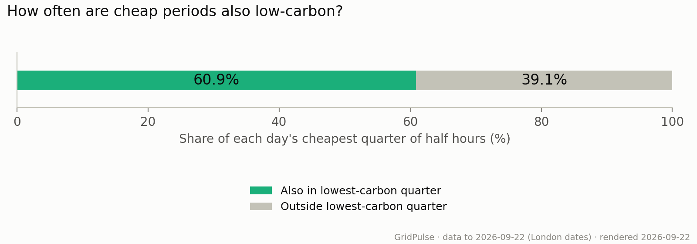

**Limitations:** This describes historical overlap, not a schedule for future cheap or low-carbon electricity. Wholesale prices are not household tariffs.

How to read this graph and methodology

Each complete 48-period day since January 2024 contributes equally. The cheapest quarter and lowest-carbon quarter each contain 12 half hours, equivalent to six hours but not necessarily consecutive. Ties at the cutoff share weight equally. Green shows the average overlap; grey shows the remainder. Days with missing prices or carbon observations and clock-change days are excluded. This answers a day-by-day question that the average daily profiles cannot answer.

[View the SQL](../scripts/metabase/daily_minima.sql).

Numbers behind the chart

| Periods | Also greenest % | Outside greenest % | Complete days |
| --- | --- | --- | --- |
| Cheapest quarter | 60.9 | 39.1 | 980 |

## Electricity supply and trade

### Midday National Demand and Embedded Solar

**What this graph shows:** Three lines track monthly average midday national demand, estimated solar generation connected to local networks (embedded solar), and demand with that solar added back. National demand already reflects the reduction from embedded solar, so the green line adds solar back; subtracting it would count the reduction twice.

**Findings (as of 22 September 2026):** July midday demand fell from 23.1 GW in 2024 to 18.9 GW in 2026, while NESO's embedded solar estimate rose from 7.0 to 12.3 GW.

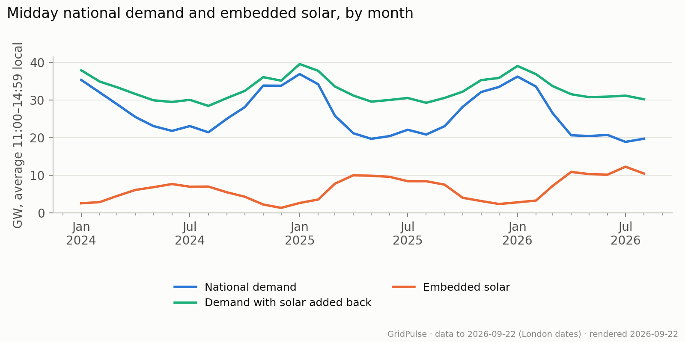

**Limitations:** Embedded solar is estimated, with historical revisions captured unevenly. The combined series does not measure demand in a world without solar or establish solar's causal effect on demand.

How to read this graph and methodology

Each point averages eligible half hours from 11:00 to 14:59 London time within a completed month, starting in January 2024. All three series use the same observations and are shown in gigawatts (1 GW = 1,000 MW). Blue is national demand, orange is estimated embedded solar, and green adds the two together. The gap between green and blue therefore equals the solar estimate. The green line is not total electricity consumption: it adds back solar only, leaving out other local generation such as embedded wind. Comparing the same month across years helps account for the seasonal cycle; the dated finding compares the earliest and latest available July.

[View the SQL](../scripts/metabase/solar.sql).

[NESO explains why embedded solar reduces measured demand](https://www.neso.energy/energy-101/electricity-explained/how-electricity-generated/what-embedded-generation-and-transmission-connected-generation).

Numbers behind the chart

| Month | National demand MW | Demand plus embedded solar MW | Embedded solar MW | Matched midday periods |
| --- | --- | --- | --- | --- |
| 2024-01-01 | 35,347 | 37,917 | 2,569 | 248 |
| 2024-02-01 | 32,014 | 34,903 | 2,890 | 232 |
| 2024-03-01 | 28,890 | 33,404 | 4,514 | 248 |
| 2024-04-01 | 25,475 | 31,603 | 6,129 | 240 |
| 2024-05-01 | 23,089 | 29,938 | 6,848 | 248 |
| 2024-06-01 | 21,805 | 29,491 | 7,686 | 240 |
| 2024-07-01 | 23,084 | 30,060 | 6,976 | 248 |
| 2024-08-01 | 21,432 | 28,444 | 7,011 | 248 |
| 2024-09-01 | 25,034 | 30,526 | 5,492 | 240 |
| 2024-10-01 | 28,116 | 32,432 | 4,316 | 248 |
| 2024-11-01 | 33,841 | 36,087 | 2,246 | 240 |
| 2024-12-01 | 33,806 | 35,157 | 1,351 | 248 |
| 2025-01-01 | 36,910 | 39,568 | 2,658 | 248 |
| 2025-02-01 | 34,205 | 37,774 | 3,569 | 224 |
| 2025-03-01 | 25,847 | 33,617 | 7,770 | 248 |
| 2025-04-01 | 21,170 | 31,195 | 10,025 | 240 |
| 2025-05-01 | 19,699 | 29,580 | 9,881 | 248 |
| 2025-06-01 | 20,434 | 30,030 | 9,596 | 240 |
| 2025-07-01 | 22,113 | 30,552 | 8,439 | 248 |
| 2025-08-01 | 20,838 | 29,274 | 8,436 | 248 |
| 2025-09-01 | 23,063 | 30,578 | 7,515 | 240 |
| 2025-10-01 | 28,179 | 32,219 | 4,040 | 248 |
| 2025-11-01 | 32,129 | 35,300 | 3,171 | 240 |
| 2025-12-01 | 33,486 | 35,869 | 2,382 | 248 |
| 2026-01-01 | 36,236 | 39,057 | 2,821 | 248 |
| 2026-02-01 | 33,584 | 36,885 | 3,301 | 224 |
| 2026-03-01 | 26,495 | 33,703 | 7,208 | 248 |
| 2026-04-01 | 20,639 | 31,547 | 10,908 | 240 |
| 2026-05-01 | 20,449 | 30,767 | 10,318 | 248 |
| 2026-06-01 | 20,721 | 30,911 | 10,190 | 240 |
| 2026-07-01 | 18,884 | 31,167 | 12,283 | 248 |
| 2026-08-01 | 19,738 | 30,210 | 10,472 | 248 |

### Net Imports Relative to National Demand

**What this graph shows:** Each bar shows net electricity imports through cross-border electricity links, as a percentage of Great Britain's national demand for that month. Exports are subtracted from imports.

**Findings (as of 22 September 2026):** Net cross-border flow was equivalent to 4.7% of national demand in September 2026. The monthly ratio ranged from 4.7% to 20.0% across the latest 12 months with data.

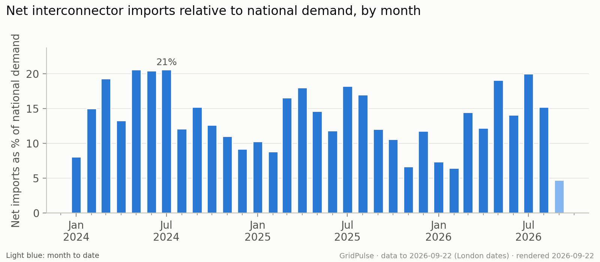

**Limitations:** Only half hours with all ten links reporting and positive settled demand are included. The Scotland–England boundary is excluded. Incomplete coverage may affect comparisons, especially for the current month.

How to read this graph and methodology

The calculation sums the net flow across all ten cross-border links for each eligible half hour, then divides the monthly sum by demand summed over those same periods. It is a ratio of totals, rather than an average of half-hourly percentages. A value of 10% means net imports were equivalent to one tenth of national demand in the matched sample. Bars above zero indicate net imports; bars below zero indicate net exports. History starts in January 2024, and a light-blue bar identifies the current, incomplete month.

[View the SQL](../scripts/metabase/imports.sql).

Numbers behind the chart

| Month | Net imports / demand % | Mean net imports MW | Matched periods |
| --- | --- | --- | --- |
| 2024-01-01 | 8.06 | 2,562 | 1488 |
| 2024-02-01 | 15.01 | 4,432 | 1392 |
| 2024-03-01 | 19.32 | 5,391 | 1486 |
| 2024-04-01 | 13.29 | 3,350 | 1440 |
| 2024-05-01 | 20.57 | 4,757 | 1488 |
| 2024-06-01 | 20.41 | 4,511 | 1440 |
| 2024-07-01 | 20.62 | 4,707 | 1488 |
| 2024-08-01 | 12.1 | 2,625 | 1488 |
| 2024-09-01 | 15.22 | 3,700 | 1440 |
| 2024-10-01 | 12.64 | 3,375 | 1490 |
| 2024-11-01 | 11.05 | 3,381 | 1440 |
| 2024-12-01 | 9.21 | 2,741 | 1488 |
| 2025-01-01 | 10.27 | 3,419 | 1488 |
| 2025-02-01 | 8.82 | 2,795 | 1344 |
| 2025-03-01 | 16.57 | 4,551 | 1486 |
| 2025-04-01 | 17.99 | 4,246 | 1440 |
| 2025-05-01 | 14.65 | 3,180 | 1488 |
| 2025-06-01 | 11.81 | 2,581 | 1440 |
| 2025-07-01 | 18.21 | 4,126 | 1488 |
| 2025-08-01 | 16.98 | 3,703 | 1488 |
| 2025-09-01 | 12.05 | 2,847 | 1440 |
| 2025-10-01 | 10.61 | 2,817 | 1490 |
| 2025-11-01 | 6.67 | 1,988 | 1440 |
| 2025-12-01 | 11.78 | 3,561 | 1488 |
| 2026-01-01 | 7.38 | 2,428 | 1488 |
| 2026-02-01 | 6.44 | 2,006 | 1344 |
| 2026-03-01 | 14.46 | 3,985 | 1486 |
| 2026-04-01 | 12.21 | 2,868 | 1440 |
| 2026-05-01 | 19.08 | 4,315 | 1488 |
| 2026-06-01 | 14.09 | 3,162 | 1440 |
| 2026-07-01 | 20.01 | 4,372 | 1488 |
| 2026-08-01 | 15.24 | 3,365 | 1488 |
| 2026-09-01 | 4.74 | 1,093 | 1008 |

### Electricity Imports and Exports by Country

**What this graph shows:** Each horizontal bar shows average net electricity flow between Great Britain and one neighbouring country over the last 90 completed days. Blue bars to the right mean imports into GB; orange bars to the left mean exports.

**Findings (as of 22 September 2026):** Across 4,320 matched half hours in the last 90 completed days, GB was a net importer at 3.03 GW on average. Country values combine all links to each destination.

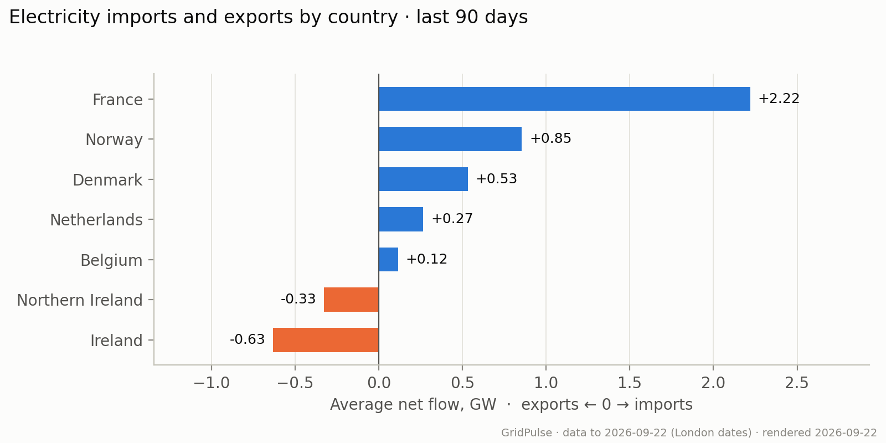

**Limitations:** Net averages conceal changes in direction within the window. Only periods with all ten cross-border links reporting are included; this does not measure each country's contribution to electricity consumed in GB.

How to read this graph and methodology

For each eligible half hour, flows on links to the same country are added together before averaging. Values are in gigawatts (1 GW = 1,000 MW). All countries use the same half hours. The internal Scotland–England boundary is excluded. Positive and negative flows cancel when calculating net flow, so a small bar can still represent substantial trading in both directions.

[View the SQL](../scripts/metabase/country_flows.sql).

Numbers behind the chart

| Country | Average net flow MW | Matched periods |
| --- | --- | --- |
| France | 2,219 | 4320 |
| Norway | 855 | 4320 |
| Denmark | 532 | 4320 |
| Netherlands | 266 | 4320 |
| Belgium | 116 | 4320 |
| Northern Ireland | -326 | 4320 |
| Ireland | -631 | 4320 |

### Forecast Carbon Intensity and Mix by Nation

**What this graph shows:** The stacked bars compare the average electricity generation mix for Scotland, England and Wales over the last 90 days. The number beside each bar is that nation's average forecast carbon intensity.

**Findings (as of 22 September 2026):** Over the last 90 days, Scotland averaged 7 gCO₂/kWh with 67% wind, against 184 for Wales with 46% gas. Carbon intensity values are forecasts, compared over the same half hours for all three nations.

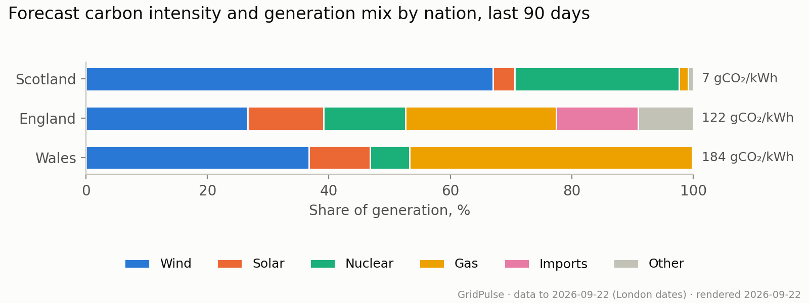

**Limitations:** Carbon intensity is forecast, not observed. Northern Ireland is outside the source's coverage. Differences between nations do not isolate the effect of any individual fuel.

How to read this graph and methodology

Each full bar represents 100%. Coloured segments show the average shares of wind, solar, nuclear, gas, imports and the remaining sources grouped as Other. These are averages of half-hourly shares, not shares of total electricity generated over the window. Only half hours with the required values for all three nations are compared. Nations are ordered from lowest to highest forecast carbon intensity, in gCO₂/kWh.

[View the SQL](../scripts/metabase/nations.sql).

Numbers behind the chart

| Nation | Forecast intensity gCO2/kWh | Wind % | Solar % | Gas % | Nuclear % | Imports % | Matched periods |
| --- | --- | --- | --- | --- | --- | --- | --- |
| Scotland | 6.8 | 67 | 3.6 | 1.5 | 27.1 | 0 | 4320 |
| England | 121.5 | 26.6 | 12.5 | 24.8 | 13.5 | 13.5 | 4320 |
| Wales | 183.5 | 36.7 | 10.1 | 46.5 | 6.5 | 0 | 4320 |

## Prices and grid conditions

### Negative Wholesale Price Frequency

**What this graph shows:** Each bar shows the percentage of priced half hours in a month when the APX wholesale electricity price was below £0/MWh. This measures how often negative prices occurred, not how far prices fell.

**Findings (as of 22 September 2026):** 1,322 of 47,734 half hours with a recorded APX wholesale price since 2024 had a negative price (2.8%), peaking at 9.5% in August 2024.

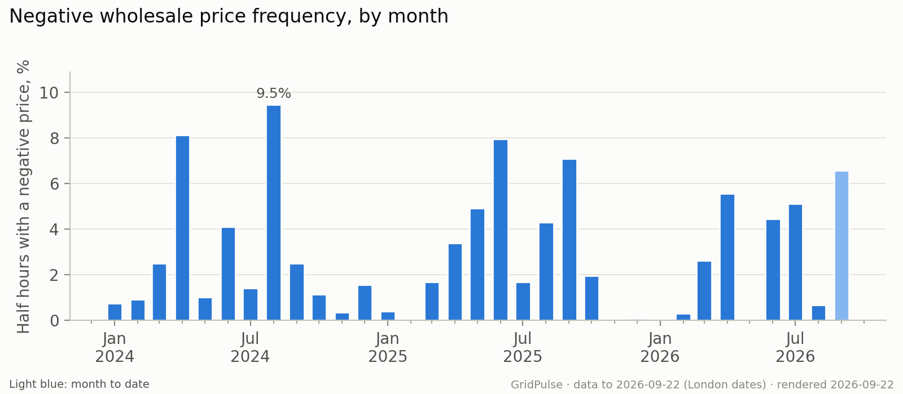

**Limitations:** Missing prices are excluded, not treated as zero or non-negative. The current month is partial. Negative wholesale prices do not imply negative household bills.

How to read this graph and methodology

For each month since January 2024, the number of negative-price half hours is divided by the number with a recorded price and multiplied by 100. A 5% bar means one in twenty priced half hours was negative. A recorded price of zero is included in the denominator but is not negative. The overall finding uses the combined counts across months, rather than averaging the bars. The tallest bar identifies the highest monthly frequency; a light-blue bar marks the current, incomplete month.

[View the SQL](../scripts/metabase/negative_frequency.sql).

Numbers behind the chart

| Month | Negative periods | Priced periods | Unpriced periods | Negative price % |
| --- | --- | --- | --- | --- |
| 2024-01-01 | 11 | 1488 | 0 | 0.74 |
| 2024-02-01 | 13 | 1392 | 0 | 0.93 |
| 2024-03-01 | 37 | 1486 | 0 | 2.49 |
| 2024-04-01 | 117 | 1439 | 1 | 8.13 |
| 2024-05-01 | 15 | 1488 | 0 | 1.01 |
| 2024-06-01 | 59 | 1440 | 0 | 4.1 |
| 2024-07-01 | 21 | 1488 | 0 | 1.41 |
| 2024-08-01 | 141 | 1488 | 0 | 9.48 |
| 2024-09-01 | 36 | 1440 | 0 | 2.5 |
| 2024-10-01 | 17 | 1490 | 0 | 1.14 |
| 2024-11-01 | 5 | 1440 | 0 | 0.35 |
| 2024-12-01 | 23 | 1488 | 0 | 1.55 |
| 2025-01-01 | 6 | 1488 | 0 | 0.4 |
| 2025-02-01 | 0 | 1344 | 0 | 0 |
| 2025-03-01 | 25 | 1486 | 0 | 1.68 |
| 2025-04-01 | 49 | 1440 | 0 | 3.4 |
| 2025-05-01 | 73 | 1488 | 0 | 4.91 |
| 2025-06-01 | 114 | 1430 | 10 | 7.97 |
| 2025-07-01 | 25 | 1488 | 0 | 1.68 |
| 2025-08-01 | 64 | 1488 | 0 | 4.3 |
| 2025-09-01 | 102 | 1439 | 1 | 7.09 |
| 2025-10-01 | 29 | 1490 | 0 | 1.95 |
| 2025-11-01 | 0 | 1440 | 0 | 0 |
| 2025-12-01 | 1 | 1488 | 0 | 0.07 |
| 2026-01-01 | 0 | 1488 | 0 | 0 |
| 2026-02-01 | 4 | 1344 | 0 | 0.3 |
| 2026-03-01 | 39 | 1486 | 0 | 2.62 |
| 2026-04-01 | 80 | 1440 | 0 | 5.56 |
| 2026-05-01 | 0 | 1486 | 2 | 0 |
| 2026-06-01 | 64 | 1440 | 0 | 4.44 |
| 2026-07-01 | 76 | 1482 | 6 | 5.13 |
| 2026-08-01 | 10 | 1488 | 0 | 0.67 |
| 2026-09-01 | 66 | 1004 | 4 | 6.57 |

### Grid Conditions During Negative Prices

**What this graph shows:** Three panels compare average national demand, renewable generation share and carbon intensity during negative versus non-negative wholesale prices. Orange bars represent negative prices; blue bars include zero and positive prices.

**Findings (as of 22 September 2026):** Renewables averaged 67.1% of generation during 1,322 negative-price half hours, versus 38.0% during 46,356 non-negative-price half hours. Average carbon intensity was 48.7 versus 128.0 gCO₂/kWh.

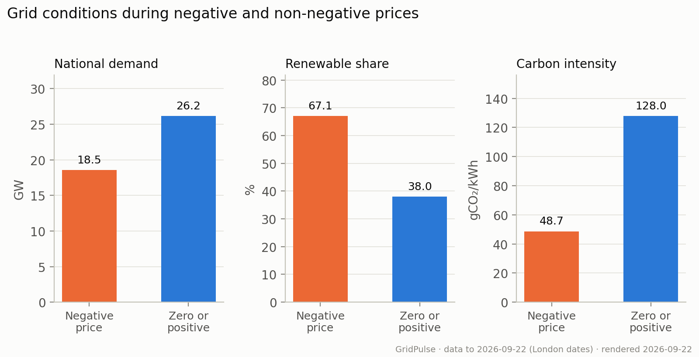

**Limitations:** These are associations, not causal effects. The groups differ in size, season and time of day. Their sample is smaller than the negative-price frequency chart because every displayed measurement must be available.

How to read this graph and methodology

Each group uses half hours since January 2024 with wholesale price, positive settled demand, wind, solar, total renewable share and observed carbon intensity available. Renewables means wind, solar and hydro. The panels use different units and independent vertical scales: compare bars within each panel, not heights across panels. Wind and solar shares and sample counts are available in the data table. Today is excluded.

[View the SQL](../scripts/metabase/negative_conditions.sql).

Numbers behind the chart

| Period type | Matched periods | Demand MW | Wind % | Solar % | Renewable % | Carbon intensity gCO2/kWh |
| --- | --- | --- | --- | --- | --- | --- |
| Negative price | 1322 | 18,541 | 51 | 15.7 | 67.1 | 48.7 |
| Non-negative price | 46356 | 26,186 | 31.2 | 6 | 38 | 128 |

### Imbalance and Wholesale Price Gap

**What this graph shows:** The lines compare the imbalance settlement price, used to settle differences between contracted and actual electricity volumes, with the APX wholesale price index. Blue shows imbalance price minus wholesale price: above zero means imbalance prices were higher. Orange shows the average size of the gap, regardless of which price was higher.

**Findings (as of 22 September 2026):** Across 47,734 matched half hours since 2024, imbalance prices averaged £0.28/MWh above wholesale prices. The average absolute gap was £19.85/MWh; it measures the size of differences in either direction.

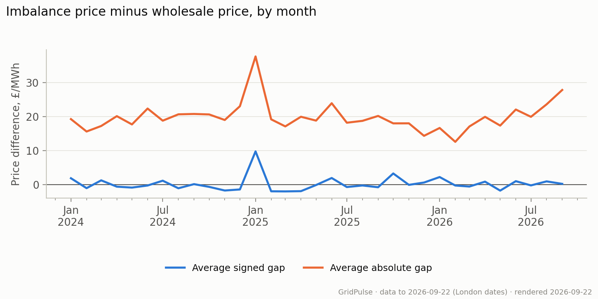

**Limitations:** The gap is not a participant's realised trading profit or imbalance cost. Monthly means can conceal large individual price spikes. The current month is incomplete.

How to read this graph and methodology

For each half hour with both prices since January 2024, subtract wholesale price from imbalance price. Average these differences within each month for the blue line: above zero means imbalance prices were higher. For the orange line, take the absolute value of each difference before averaging, so positive and negative gaps cannot cancel. The overall finding weights monthly means by their matched-period counts; minor rounding differences are possible. Prices are in pounds per megawatt-hour (£/MWh), and today is excluded.

[View the SQL](../scripts/metabase/imbalance_spread.sql).

Numbers behind the chart

| Month | Mean spread GBP/MWh | Mean absolute spread GBP/MWh | Matched periods |
| --- | --- | --- | --- |
| 2024-01-01 | 1.92 | 19.27 | 1488 |
| 2024-02-01 | -0.99 | 15.63 | 1392 |
| 2024-03-01 | 1.3 | 17.25 | 1486 |
| 2024-04-01 | -0.55 | 20.14 | 1439 |
| 2024-05-01 | -0.82 | 17.71 | 1488 |
| 2024-06-01 | -0.21 | 22.37 | 1440 |
| 2024-07-01 | 1.2 | 18.81 | 1488 |
| 2024-08-01 | -1.02 | 20.67 | 1488 |
| 2024-09-01 | 0.19 | 20.78 | 1440 |
| 2024-10-01 | -0.61 | 20.64 | 1490 |
| 2024-11-01 | -1.68 | 19.01 | 1440 |
| 2024-12-01 | -1.37 | 23.05 | 1488 |
| 2025-01-01 | 9.79 | 37.65 | 1488 |
| 2025-02-01 | -1.91 | 19.2 | 1344 |
| 2025-03-01 | -1.94 | 17.13 | 1486 |
| 2025-04-01 | -1.87 | 19.96 | 1440 |
| 2025-05-01 | -0.07 | 18.83 | 1488 |
| 2025-06-01 | 1.99 | 23.93 | 1430 |
| 2025-07-01 | -0.66 | 18.21 | 1488 |
| 2025-08-01 | -0.2 | 18.76 | 1488 |
| 2025-09-01 | -0.72 | 20.2 | 1439 |
| 2025-10-01 | 3.32 | 18.02 | 1490 |
| 2025-11-01 | -0.02 | 18.03 | 1440 |
| 2025-12-01 | 0.66 | 14.36 | 1488 |
| 2026-01-01 | 2.27 | 16.67 | 1488 |
| 2026-02-01 | -0.21 | 12.6 | 1344 |
| 2026-03-01 | -0.51 | 17.11 | 1486 |
| 2026-04-01 | 0.92 | 19.94 | 1440 |
| 2026-05-01 | -1.71 | 17.37 | 1486 |
| 2026-06-01 | 1.06 | 22.08 | 1440 |
| 2026-07-01 | -0.18 | 19.94 | 1482 |
| 2026-08-01 | 1 | 23.6 | 1488 |
| 2026-09-01 | 0.27 | 27.82 | 1004 |

### Imbalance Prices by Grid Conditions

**What this graph shows:** The heatmap groups half hours by national demand and the renewable share of generation. Each cell shows the average imbalance settlement price and its number of observations (n). Grey cells have no matching observations. Striped cells have fewer than 100 observations and are excluded from the colour scale.

**Findings (as of 22 September 2026):** Among groups with at least 100 half hours, the highest average imbalance price was £199.64/MWh at 40–45 GW demand and 0–20% renewables (307 half hours). This is an association, not evidence that either factor caused the price.

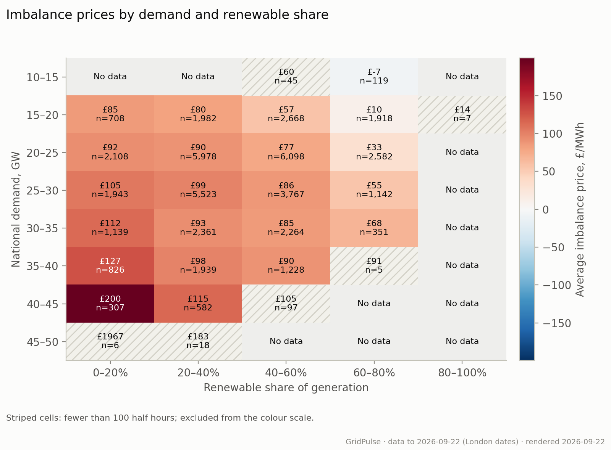

**Limitations:** Averages in small groups are unstable and sensitive to extreme prices. Demand and renewable share alone cannot explain price formation; season, fuel prices and system constraints also vary.

How to read this graph and methodology

Rows are 5 GW demand bands; columns are 20-percentage-point renewable bands. Lower bounds are included and upper bounds excluded, except the final renewable band includes 100%. Renewables comprises wind, solar and hydro. Red means a positive average price; blue means a negative average, with stronger colour indicating a larger magnitude. Every eligible half hour since January 2024 needs positive settled demand, a renewable share from 0% to 100% and an imbalance price. The colour scale and headline only compare groups with at least 100 observations, a descriptive filter rather than a statistical significance test. All other observed averages remain labelled in striped cells and listed in the data table. Today is excluded.

[View the SQL](../scripts/metabase/imbalance_conditions.sql).

Numbers behind the chart

| Demand bin lower bound GW | Renewable bin lower bound % | Mean imbalance price GBP/MWh | Matched periods |
| --- | --- | --- | --- |
| 10 | 40 | 60.34 | 45 |
| 10 | 60 | -7.07 | 119 |
| 15 | 0 | 85.31 | 708 |
| 15 | 20 | 80.36 | 1982 |
| 15 | 40 | 56.99 | 2668 |
| 15 | 60 | 9.82 | 1918 |
| 15 | 80 | 13.92 | 7 |
| 20 | 0 | 92.15 | 2108 |
| 20 | 20 | 90.14 | 5978 |
| 20 | 40 | 77.35 | 6098 |
| 20 | 60 | 32.59 | 2582 |
| 25 | 0 | 105.24 | 1943 |
| 25 | 20 | 98.99 | 5523 |
| 25 | 40 | 86.05 | 3767 |
| 25 | 60 | 55.41 | 1142 |
| 30 | 0 | 112.3 | 1139 |
| 30 | 20 | 93.15 | 2361 |
| 30 | 40 | 84.92 | 2264 |
| 30 | 60 | 68.09 | 351 |
| 35 | 0 | 126.58 | 826 |
| 35 | 20 | 98.39 | 1939 |
| 35 | 40 | 90.36 | 1228 |
| 35 | 60 | 91.03 | 5 |
| 40 | 0 | 199.64 | 307 |
| 40 | 20 | 114.72 | 582 |
| 40 | 40 | 104.88 | 97 |
| 45 | 0 | 1,967 | 6 |
| 45 | 20 | 183.04 | 18 |

## Forecast accuracy

### Average Demand Forecast Error by Hours Ahead

**What this graph shows:** This chart compares the accuracy of Elexon's national demand forecasts made from 30 minutes to 21 hours before the half hour being predicted. Each point shows the average size of the forecast error.

**Findings (as of 22 September 2026):** Elexon's national demand forecast is off by an average of 504 MW 0.5 hours ahead and 653 MW 21 hours ahead, scored on the same 35,466 half hours at each forecast timing. Smaller errors indicate greater accuracy.

**Limitations:** Only half hours with a usable forecast at each of the six forecast timings are included, so the sample may not represent every period. Historical publications recovered after outages are included; this evaluates the publisher's forecasts, not the data available to this pipeline in real time.

How to read this graph and methodology

Mean absolute error (MAE) is the average absolute difference between forecast and observed demand, in megawatts. Overestimates and underestimates therefore do not cancel out. For each target half hour, the calculation selects the latest eligible forecast published between the stated number of hours ahead and 30 minutes earlier. For example, the 3-hour point uses forecasts published 3 to 3.5 hours before the predicted half hour begins. All six points use the same target periods since January 2024. Lower points indicate more accurate forecasts. The horizontal scale is logarithmic, so moving from 0.5 to 1 hour takes the same space as moving from 1 to 2 hours. Read the tick labels to see how far ahead each forecast was made.

[View the SQL](../scripts/metabase/demand_accuracy.sql).

Numbers behind the chart

| Hours ahead | Average error (MW) | Bias MW | Matched target periods |
| --- | --- | --- | --- |
| 0.5 | 503.9 | 2.8 | 35466 |
| 1 | 508.7 | 2.6 | 35466 |
| 2 | 518.1 | 2.4 | 35466 |
| 4 | 535.5 | 1.3 | 35466 |
| 8 | 565.2 | 1.4 | 35466 |
| 21 | 653.3 | -3.6 | 35466 |

### Carbon Forecast Error by Month

**What this graph shows:** Each bar shows the average size of the difference between stored national carbon intensity forecasts and observations for that month. Lower bars mean closer agreement; light blue marks the current, incomplete month.

**Findings (as of 22 September 2026):** Stored carbon forecasts differed from observed intensity by 9.8 gCO₂/kWh on average across 47,684 matched half hours. Forecasts averaged 0.2 gCO₂/kWh below observations.

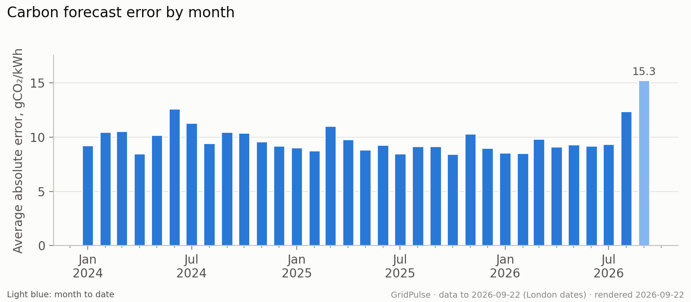

**Limitations:** The stored forecasts were not captured at a consistent number of hours before delivery. This checks agreement with observations, but cannot establish day-ahead forecast performance or be compared directly with the demand forecast timing analysis.

How to read this graph and methodology

For each half hour with both values since January 2024, take the absolute forecast-minus-observation difference, then average within the month. Errors are measured in grams of CO₂ per kilowatt-hour. Overestimates and underestimates do not cancel. Signed bias, retained in the data table, shows whether forecasts tend to be above or below observations. The overall finding weights monthly means by the number of matched half hours, with minor rounding possible. Today is excluded.

[View the SQL](../scripts/metabase/carbon_accuracy.sql).

Numbers behind the chart

| Month | MAE gCO2/kWh | Bias gCO2/kWh | Matched periods |
| --- | --- | --- | --- |
| 2024-01-01 | 9.25 | 0.33 | 1488 |
| 2024-02-01 | 10.47 | 0.73 | 1392 |
| 2024-03-01 | 10.55 | -0.68 | 1486 |
| 2024-04-01 | 8.5 | -0.21 | 1440 |
| 2024-05-01 | 10.21 | 0.84 | 1488 |
| 2024-06-01 | 12.64 | -5.07 | 1409 |
| 2024-07-01 | 11.32 | -2.51 | 1488 |
| 2024-08-01 | 9.45 | -2.16 | 1488 |
| 2024-09-01 | 10.47 | -0.02 | 1440 |
| 2024-10-01 | 10.4 | -3.13 | 1490 |
| 2024-11-01 | 9.6 | -2 | 1440 |
| 2024-12-01 | 9.2 | 0.52 | 1488 |
| 2025-01-01 | 9.06 | -0.18 | 1462 |
| 2025-02-01 | 8.78 | 1.09 | 1344 |
| 2025-03-01 | 11.02 | 3.24 | 1486 |
| 2025-04-01 | 9.79 | 1.99 | 1440 |
| 2025-05-01 | 8.86 | -0.67 | 1488 |
| 2025-06-01 | 9.27 | -2.1 | 1440 |
| 2025-07-01 | 8.48 | 0.65 | 1488 |
| 2025-08-01 | 9.16 | 0.12 | 1471 |
| 2025-09-01 | 9.18 | 0.57 | 1440 |
| 2025-10-01 | 8.46 | 0.62 | 1490 |
| 2025-11-01 | 10.31 | 3.42 | 1440 |
| 2025-12-01 | 9.01 | 2.96 | 1488 |
| 2026-01-01 | 8.56 | 1.78 | 1488 |
| 2026-02-01 | 8.51 | 1.98 | 1344 |
| 2026-03-01 | 9.85 | 0.44 | 1486 |
| 2026-04-01 | 9.13 | -0.72 | 1440 |
| 2026-05-01 | 9.34 | -0.79 | 1488 |
| 2026-06-01 | 9.21 | -0.38 | 1440 |
| 2026-07-01 | 9.36 | -0.84 | 1488 |
| 2026-08-01 | 12.37 | -1.27 | 1488 |
| 2026-09-01 | 15.27 | -5.45 | 1008 |

## Data quality

### Monthly Data Coverage

**What this graph shows:** The heatmap shows what percentage of expected half hours have each measurement. Darker cells mean more complete coverage; pale cells reveal missing data. The first row checks whether a row exists in the combined analysis dataset.

**Findings (as of 22 September 2026):** In September 2026, wholesale prices had the lowest coverage of the displayed measures at 99.6% of 1,008 expected half hours through yesterday. Availability does not guarantee accuracy or a complete matched sample.

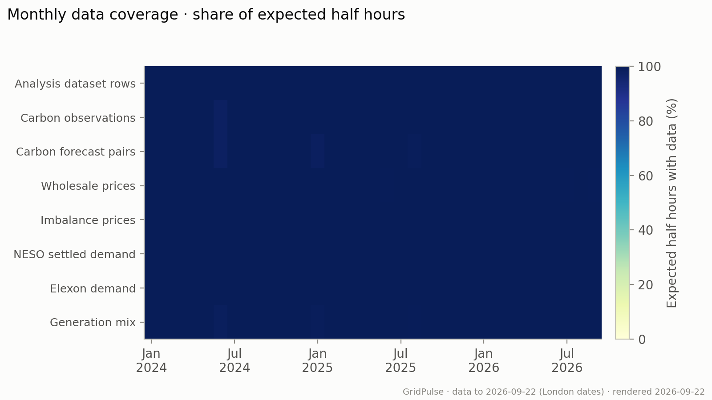

**Limitations:** A present value may still be incorrect or later revised. High coverage of individual fields does not guarantee that all fields needed for a particular analysis are available together.

How to read this graph and methodology

Expected periods come from the calendar table since January 2024, through yesterday, accounting for clock changes. Each cell divides the count with data by the expected count for its month. Carbon forecast pairs require both forecast and observed intensity. NESO settled demand additionally requires positive demand. Elexon demand observations are the national demand outturn used in the forecast evaluation. Coverage is separate from the counts of matched periods beneath the analytical charts.

[View the SQL](../scripts/metabase/coverage.sql).

Numbers behind the chart

| Month | Expected periods | Mart periods | Carbon actual periods | Carbon forecast pairs | Market price periods | Imbalance price periods | Settled NESO periods | INDO periods | Generation mix periods | Latest priced period UTC | Latest settled demand UTC |
| --- | --- | --- | --- | --- | --- | --- | --- | --- | --- | --- | --- |
| 2026-09-01 | 1008 | 1008 | 1008 | 1008 | 1004 | 1008 | 1008 | 1008 | 1008 | 2026-09-21 22:30:00+00:00 | 2026-09-21 22:30:00+00:00 |
| 2026-08-01 | 1488 | 1488 | 1488 | 1488 | 1488 | 1488 | 1488 | 1488 | 1488 | 2026-08-31 22:30:00+00:00 | 2026-08-31 22:30:00+00:00 |
| 2026-07-01 | 1488 | 1488 | 1488 | 1488 | 1482 | 1488 | 1488 | 1488 | 1488 | 2026-07-31 22:30:00+00:00 | 2026-07-31 22:30:00+00:00 |
| 2026-06-01 | 1440 | 1440 | 1440 | 1440 | 1440 | 1440 | 1440 | 1440 | 1440 | 2026-06-30 22:30:00+00:00 | 2026-06-30 22:30:00+00:00 |
| 2026-05-01 | 1488 | 1488 | 1488 | 1488 | 1486 | 1488 | 1488 | 1488 | 1488 | 2026-05-31 22:30:00+00:00 | 2026-05-31 22:30:00+00:00 |
| 2026-04-01 | 1440 | 1440 | 1440 | 1440 | 1440 | 1440 | 1440 | 1440 | 1440 | 2026-04-30 22:30:00+00:00 | 2026-04-30 22:30:00+00:00 |
| 2026-03-01 | 1486 | 1486 | 1486 | 1486 | 1486 | 1486 | 1486 | 1486 | 1486 | 2026-03-31 22:30:00+00:00 | 2026-03-31 22:30:00+00:00 |
| 2026-02-01 | 1344 | 1344 | 1344 | 1344 | 1344 | 1344 | 1344 | 1344 | 1344 | 2026-02-28 23:30:00+00:00 | 2026-02-28 23:30:00+00:00 |
| 2026-01-01 | 1488 | 1488 | 1488 | 1488 | 1488 | 1488 | 1488 | 1488 | 1488 | 2026-01-31 23:30:00+00:00 | 2026-01-31 23:30:00+00:00 |
| 2025-12-01 | 1488 | 1488 | 1488 | 1488 | 1488 | 1488 | 1488 | 1488 | 1488 | 2025-12-31 23:30:00+00:00 | 2025-12-31 23:30:00+00:00 |
| 2025-11-01 | 1440 | 1440 | 1440 | 1440 | 1440 | 1440 | 1440 | 1440 | 1440 | 2025-11-30 23:30:00+00:00 | 2025-11-30 23:30:00+00:00 |
| 2025-10-01 | 1490 | 1490 | 1490 | 1490 | 1490 | 1490 | 1490 | 1490 | 1490 | 2025-10-31 23:30:00+00:00 | 2025-10-31 23:30:00+00:00 |
| 2025-09-01 | 1440 | 1440 | 1440 | 1440 | 1439 | 1440 | 1440 | 1440 | 1440 | 2025-09-30 22:30:00+00:00 | 2025-09-30 22:30:00+00:00 |
| 2025-08-01 | 1488 | 1488 | 1488 | 1471 | 1488 | 1488 | 1488 | 1488 | 1480 | 2025-08-31 22:30:00+00:00 | 2025-08-31 22:30:00+00:00 |
| 2025-07-01 | 1488 | 1488 | 1488 | 1488 | 1488 | 1488 | 1488 | 1488 | 1488 | 2025-07-31 22:30:00+00:00 | 2025-07-31 22:30:00+00:00 |
| 2025-06-01 | 1440 | 1440 | 1440 | 1440 | 1430 | 1440 | 1440 | 1440 | 1440 | 2025-06-30 22:30:00+00:00 | 2025-06-30 22:30:00+00:00 |
| 2025-05-01 | 1488 | 1488 | 1488 | 1488 | 1488 | 1488 | 1488 | 1488 | 1488 | 2025-05-31 22:30:00+00:00 | 2025-05-31 22:30:00+00:00 |
| 2025-04-01 | 1440 | 1440 | 1440 | 1440 | 1440 | 1440 | 1440 | 1440 | 1440 | 2025-04-30 22:30:00+00:00 | 2025-04-30 22:30:00+00:00 |
| 2025-03-01 | 1486 | 1486 | 1486 | 1486 | 1486 | 1486 | 1486 | 1486 | 1486 | 2025-03-31 22:30:00+00:00 | 2025-03-31 22:30:00+00:00 |
| 2025-02-01 | 1344 | 1344 | 1344 | 1344 | 1344 | 1344 | 1344 | 1344 | 1344 | 2025-02-28 23:30:00+00:00 | 2025-02-28 23:30:00+00:00 |
| 2025-01-01 | 1488 | 1488 | 1488 | 1462 | 1488 | 1488 | 1488 | 1488 | 1471 | 2025-01-31 23:30:00+00:00 | 2025-01-31 23:30:00+00:00 |
| 2024-12-01 | 1488 | 1488 | 1488 | 1488 | 1488 | 1488 | 1488 | 1488 | 1488 | 2024-12-31 23:30:00+00:00 | 2024-12-31 23:30:00+00:00 |
| 2024-11-01 | 1440 | 1440 | 1440 | 1440 | 1440 | 1440 | 1440 | 1440 | 1440 | 2024-11-30 23:30:00+00:00 | 2024-11-30 23:30:00+00:00 |
| 2024-10-01 | 1490 | 1490 | 1490 | 1490 | 1490 | 1490 | 1490 | 1490 | 1490 | 2024-10-31 23:30:00+00:00 | 2024-10-31 23:30:00+00:00 |
| 2024-09-01 | 1440 | 1440 | 1440 | 1440 | 1440 | 1440 | 1440 | 1440 | 1440 | 2024-09-30 22:30:00+00:00 | 2024-09-30 22:30:00+00:00 |
| 2024-08-01 | 1488 | 1488 | 1488 | 1488 | 1488 | 1488 | 1488 | 1488 | 1488 | 2024-08-31 22:30:00+00:00 | 2024-08-31 22:30:00+00:00 |
| 2024-07-01 | 1488 | 1488 | 1488 | 1488 | 1488 | 1488 | 1488 | 1488 | 1488 | 2024-07-31 22:30:00+00:00 | 2024-07-31 22:30:00+00:00 |
| 2024-06-01 | 1440 | 1440 | 1409 | 1409 | 1440 | 1440 | 1440 | 1440 | 1418 | 2024-06-30 22:30:00+00:00 | 2024-06-30 22:30:00+00:00 |
| 2024-05-01 | 1488 | 1488 | 1488 | 1488 | 1488 | 1488 | 1488 | 1488 | 1488 | 2024-05-31 22:30:00+00:00 | 2024-05-31 22:30:00+00:00 |
| 2024-04-01 | 1440 | 1440 | 1440 | 1440 | 1439 | 1440 | 1440 | 1440 | 1440 | 2024-04-30 22:30:00+00:00 | 2024-04-30 22:30:00+00:00 |
| 2024-03-01 | 1486 | 1486 | 1486 | 1486 | 1486 | 1486 | 1486 | 1486 | 1486 | 2024-03-31 22:30:00+00:00 | 2024-03-31 22:30:00+00:00 |
| 2024-02-01 | 1392 | 1392 | 1392 | 1392 | 1392 | 1392 | 1392 | 1392 | 1392 | 2024-02-29 23:30:00+00:00 | 2024-02-29 23:30:00+00:00 |
| 2024-01-01 | 1488 | 1488 | 1488 | 1488 | 1488 | 1488 | 1488 | 1488 | 1488 | 2024-01-31 23:30:00+00:00 | 2024-01-31 23:30:00+00:00 |

### Demand Forecast Publication Coverage

**What this graph shows:** Blue bars count the 30-minute publication windows containing at least one demand forecast on each UTC day. The dashed orange line shows the expected 48 windows per day.

**Findings (as of 22 September 2026):** Forecast publications were recorded in 3,069 of 3,072 expected 30-minute windows (99.9%). 1 of 64 UTC days had at least one missing window.

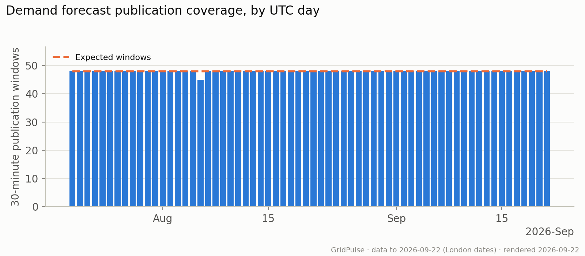

**Limitations:** Missing windows may reflect collection gaps or irregular publication times. A present window does not guarantee every target-period forecast is available, and recovered history does not prove the pipeline had it in real time.

How to read this graph and methodology

Publications are assigned to consecutive 30-minute UTC windows from 20 July 2026 through yesterday UTC. A window counts once regardless of how many target periods it contains. UTC days always have 48 windows, including UK clock-change days. The data table also shows missing windows and forecast-row counts. This measures publication coverage, while the separate demand accuracy chart uses only target periods with forecasts available at every compared timing.

[View the SQL](../scripts/metabase/publication_coverage.sql).

Numbers behind the chart

| UTC publication day | Expected slots | Present slots | Missing slots | Forecast rows in expected slots |
| --- | --- | --- | --- | --- |
| 2026-09-21 | 48 | 48 | 0 | 2,816 |
| 2026-09-20 | 48 | 48 | 0 | 2,816 |
| 2026-09-19 | 48 | 48 | 0 | 2,816 |
| 2026-09-18 | 48 | 48 | 0 | 2,816 |
| 2026-09-17 | 48 | 48 | 0 | 2,816 |
| 2026-09-16 | 48 | 48 | 0 | 2,816 |
| 2026-09-15 | 48 | 48 | 0 | 2,816 |
| 2026-09-14 | 48 | 48 | 0 | 2,816 |
| 2026-09-13 | 48 | 48 | 0 | 2,816 |
| 2026-09-12 | 48 | 48 | 0 | 2,816 |
| 2026-09-11 | 48 | 48 | 0 | 2,816 |
| 2026-09-10 | 48 | 48 | 0 | 2,816 |
| 2026-09-09 | 48 | 48 | 0 | 2,816 |
| 2026-09-08 | 48 | 48 | 0 | 2,816 |
| 2026-09-07 | 48 | 48 | 0 | 2,816 |
| 2026-09-06 | 48 | 48 | 0 | 2,816 |
| 2026-09-05 | 48 | 48 | 0 | 2,816 |
| 2026-09-04 | 48 | 48 | 0 | 2,816 |
| 2026-09-03 | 48 | 48 | 0 | 2,816 |
| 2026-09-02 | 48 | 48 | 0 | 2,816 |
| 2026-09-01 | 48 | 48 | 0 | 2,816 |
| 2026-08-31 | 48 | 48 | 0 | 2,816 |
| 2026-08-30 | 48 | 48 | 0 | 2,816 |
| 2026-08-29 | 48 | 48 | 0 | 2,816 |
| 2026-08-28 | 48 | 48 | 0 | 2,816 |
| 2026-08-27 | 48 | 48 | 0 | 2,816 |
| 2026-08-26 | 48 | 48 | 0 | 2,816 |
| 2026-08-25 | 48 | 48 | 0 | 2,816 |
| 2026-08-24 | 48 | 48 | 0 | 2,816 |
| 2026-08-23 | 48 | 48 | 0 | 2,816 |
| 2026-08-22 | 48 | 48 | 0 | 2,816 |
| 2026-08-21 | 48 | 48 | 0 | 2,816 |
| 2026-08-20 | 48 | 48 | 0 | 2,816 |
| 2026-08-19 | 48 | 48 | 0 | 2,816 |
| 2026-08-18 | 48 | 48 | 0 | 2,816 |
| 2026-08-17 | 48 | 48 | 0 | 2,816 |
| 2026-08-16 | 48 | 48 | 0 | 2,816 |
| 2026-08-15 | 48 | 48 | 0 | 2,816 |
| 2026-08-14 | 48 | 48 | 0 | 2,816 |
| 2026-08-13 | 48 | 48 | 0 | 2,816 |
| 2026-08-12 | 48 | 48 | 0 | 2,816 |
| 2026-08-11 | 48 | 48 | 0 | 2,816 |
| 2026-08-10 | 48 | 48 | 0 | 2,816 |
| 2026-08-09 | 48 | 48 | 0 | 2,816 |
| 2026-08-08 | 48 | 48 | 0 | 2,816 |
| 2026-08-07 | 48 | 48 | 0 | 2,816 |
| 2026-08-06 | 48 | 45 | 3 | 2,739 |
| 2026-08-05 | 48 | 48 | 0 | 2,816 |
| 2026-08-04 | 48 | 48 | 0 | 2,816 |
| 2026-08-03 | 48 | 48 | 0 | 2,816 |
| 2026-08-02 | 48 | 48 | 0 | 2,816 |
| 2026-08-01 | 48 | 48 | 0 | 2,816 |
| 2026-07-31 | 48 | 48 | 0 | 2,816 |
| 2026-07-30 | 48 | 48 | 0 | 2,816 |
| 2026-07-29 | 48 | 48 | 0 | 2,816 |
| 2026-07-28 | 48 | 48 | 0 | 2,816 |
| 2026-07-27 | 48 | 48 | 0 | 2,816 |
| 2026-07-26 | 48 | 48 | 0 | 2,816 |
| 2026-07-25 | 48 | 48 | 0 | 2,816 |
| 2026-07-24 | 48 | 48 | 0 | 2,816 |
| 2026-07-23 | 48 | 48 | 0 | 2,816 |
| 2026-07-22 | 48 | 48 | 0 | 2,816 |
| 2026-07-21 | 48 | 48 | 0 | 2,816 |
| 2026-07-20 | 48 | 48 | 0 | 2,816 |

